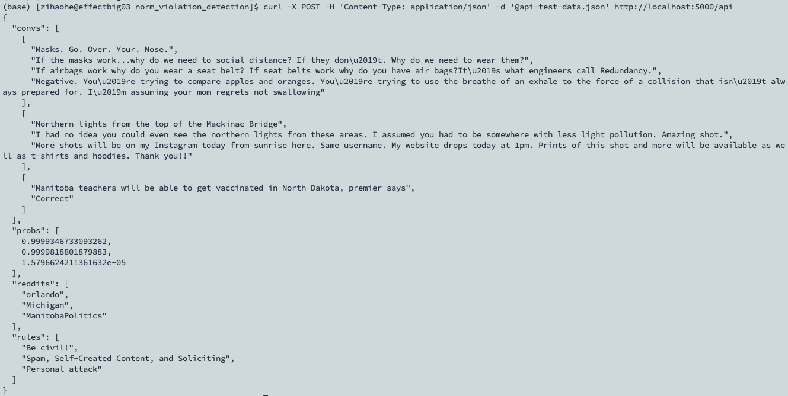

# Norm Violation Detection
This is the repo for norm violation detection on Reddit.

## Data (Skip this if you're just doing inference)
Decompress the data file
```angular2html
tar -xzf data.tar.gz
```


## Checkpoint (Skip this if you're training the model from scratch)
The BERT-LSTM model checkpoint is accessible from this Google Drive [link](https://drive.google.com/file/d/1dF9Ksg0h72-T8WhI6KlxOoC6FQOtrKDY/view?usp=sharing).
Download the model to *ckps/clf/bert-base-uncased/1/seed=2022*.

The T5 model checkpoint is accessible from this Google Drive [link](https://drive.google.com/file/d/1d_Slq27WImGS8D1qZYp3_xsWtCst11FX/view?usp=share_link).
Download the model to *ckps/prompt/t5-base/1/seed=2022*.


## Using the API
Instantiate the API:

Using BERT
```angular2html
python api-inference.py --task=clf --model_name=bert-base-uncased
```

Using T5
```angular2html
python api-inference.py --task=prompt --mdoel_name=t5-base
```

If GPUs are available, specify the GPU(s) to use:
```angular2html
python api-inference.py --task=prompt --model_name=t5-base --gpu=0
```

Then prepare the query data as in *api-test-data.json*.

Calling the API:
```angular2html
curl -X POST -H 'Content-Type: application/json' -d '@api-test-data.json' http://localhost:5000/api
```


The following is an example of the API. In the input file *api-test-data.json* there are three conversations, along with there subreddits and specified rules.
The model outputs the confidence scores that the last comments from the conversations violate their corresponding rules.
